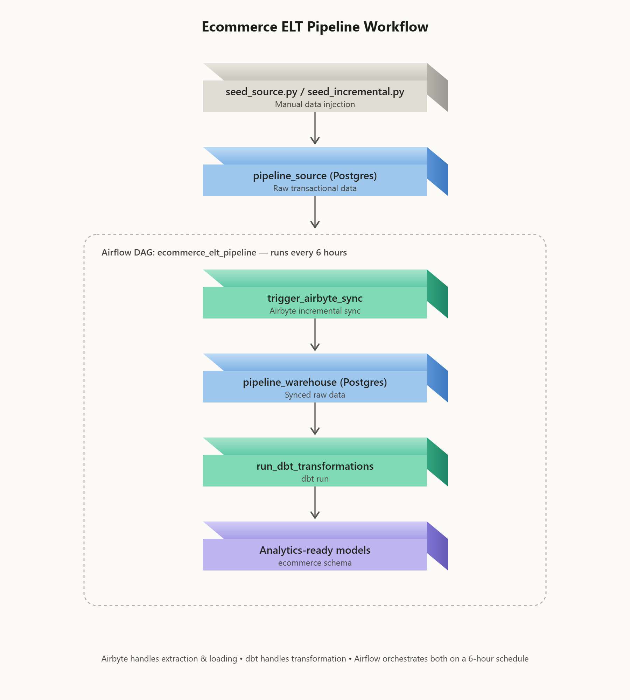

# Ecommerce ELT Analytical Pipeline

## 1. Introduction

This project is an end-to-end **ELT (Extract, Load, Transform)** pipeline built to
ingest, sync, and transform ecommerce transactional data for analytics.

Raw operational data (customers, products, orders, order items) is generated in a
source Postgres database, extracted and loaded into a warehouse Postgres database
via **Airbyte**, transformed into clean analytics-ready models with **dbt**, and the
whole process is orchestrated and scheduled with **Apache Airflow** — all running
in Docker containers.

The pipeline is designed to demonstrate a realistic, production-style ELT setup:
incremental data syncing, containerized services, and scheduled orchestration,
rather than a one-off script.

## 2. Setup

Every component of this project runs in Docker. Each service has its own setup
guide linked below rather than duplicated here, since setup steps can change
over time and the official/source docs are the most reliable reference.

| Component | What it does in this project | Setup reference |
|---|---|---|
| **Docker / Docker Compose** | Containerizes and networks every service in this pipeline | [Docker Compose docs](https://docs.docker.com/compose/) |
| **Apache Airflow** | Orchestrates and schedules the pipeline (Airbyte sync + dbt run) | See my production Airflow setup repo: [Production Airflow setup](https://github.com/PyCoder63/production_airflow_setup) |
| **Airbyte** | Extracts data from the source database and loads it into the warehouse | [Official Airbyte self-hosted setup](https://docs.airbyte.com/using-airbyte/getting-started/oss-quickstart) |
| **dbt** | Transforms raw warehouse data into analytics-ready models | [Official dbt setup guide](https://docs.getdbt.com/docs/core/installation-overview) |
| **PostgreSQL (warehouse)** | Serves as both the pipeline source and destination warehouse | See the `pipeline-db` directory in this repo — includes the `docker-compose.yaml` used to spin up the warehouse database |

## 3. Stack

- **Python** — seed/data-generation scripts, DAG definitions
- **SQL** — dbt models and transformations
- **Bash** — container entrypoints and CLI operations
- **Git** — version control

## 4. Workflow

**Summary:** Data is manually seeded into the source database, Airbyte
incrementally syncs new records into the warehouse, and dbt transforms that raw
data into analytics-ready models — all triggered by an Airflow DAG running on a
6-hour schedule.

### Stage-by-stage breakdown

**1. Manual seed injection**
A Python script (`seed_source.py` for the initial load, `seed_incremental.py` for
subsequent batches) connects directly to `pipeline_source` and inserts new rows
across `customers`, `products`, `orders`, and `order_items`. The incremental seed
script reads the current max ID / max `order_date` per table first, so every run
appends genuinely new records instead of duplicating existing ones — this is what
lets the pipeline realistically test incremental sync behavior downstream.

**2. Airbyte sync (source → warehouse)**
The Airflow DAG's first task, `trigger_airbyte_sync`, calls Airbyte's API to run a
configured connection that extracts data from `pipeline_source` and loads it into
`pipeline_warehouse`. Airbyte is configured for incremental sync, so only new or
changed records are pulled on each run rather than a full table re-copy.

**3. dbt transformation (warehouse → analytics models)**
Once the sync completes, the DAG's second task, `run_dbt_transformations`, runs
`dbt run` against the warehouse. dbt reads the newly synced raw tables and builds
out clean, modeled tables in the `ecommerce` schema — ready for downstream
analytics or BI use.

**4. Airflow orchestration**
Both tasks are chained (`trigger_airbyte_sync >> run_dbt_transformations`) inside
a single Airflow DAG scheduled to run every 6 hours (`0 */6 * * *`). This ensures
the sync always completes before transformations run, and that the warehouse
stays up to date automatically without manual intervention — except for seeding
new source data, which remains a manual/test step in this project.
