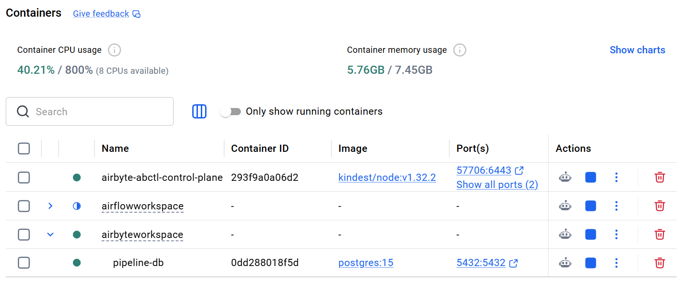
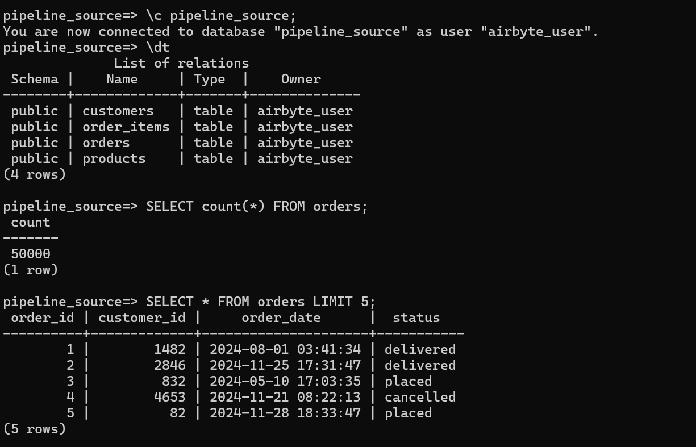
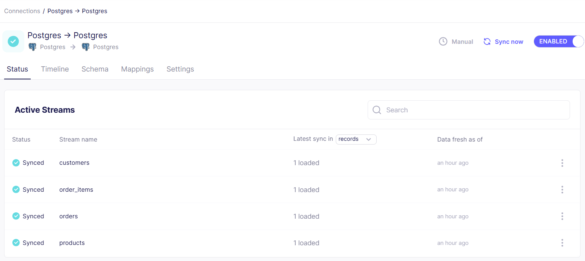
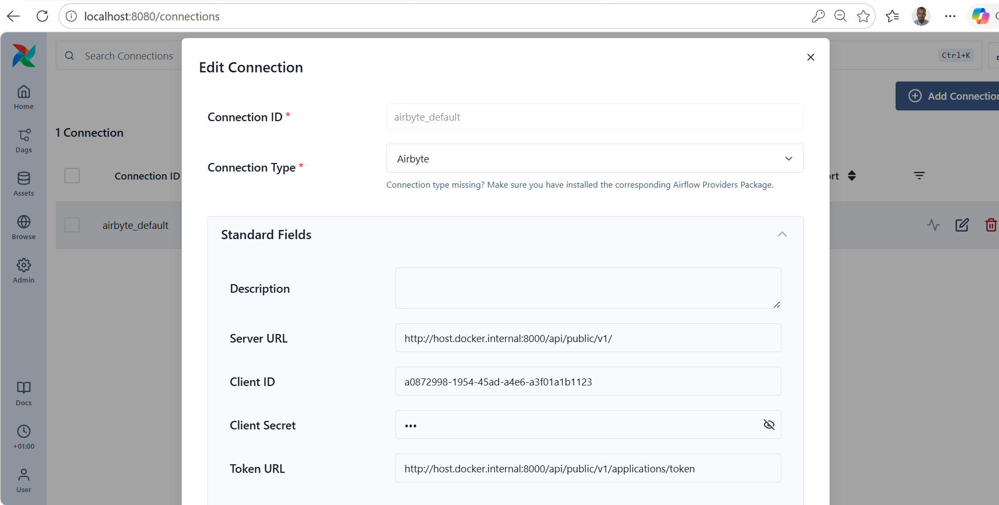
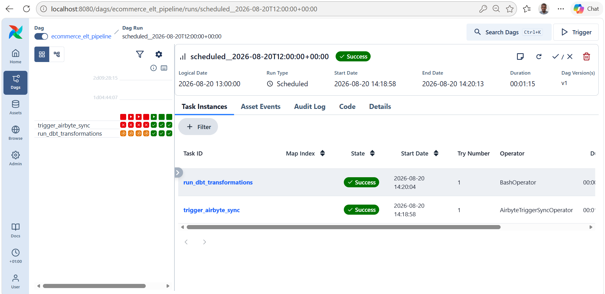
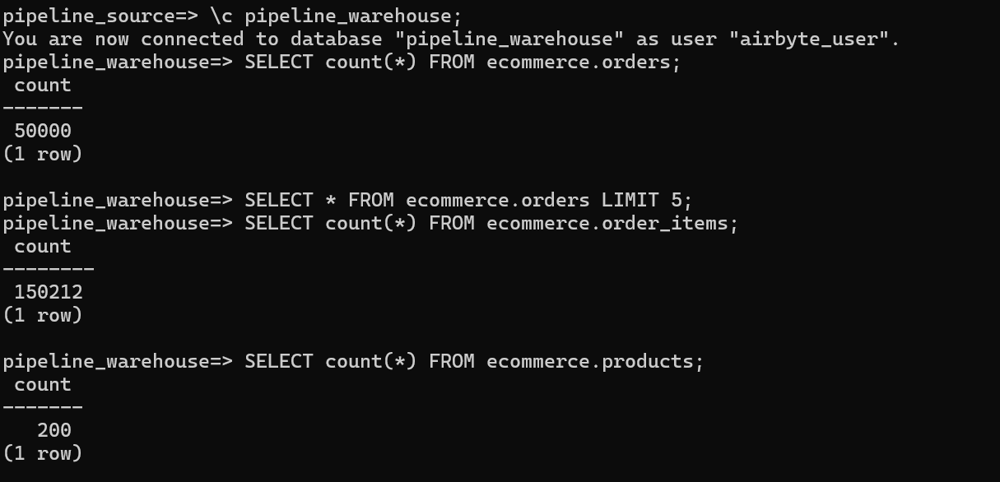
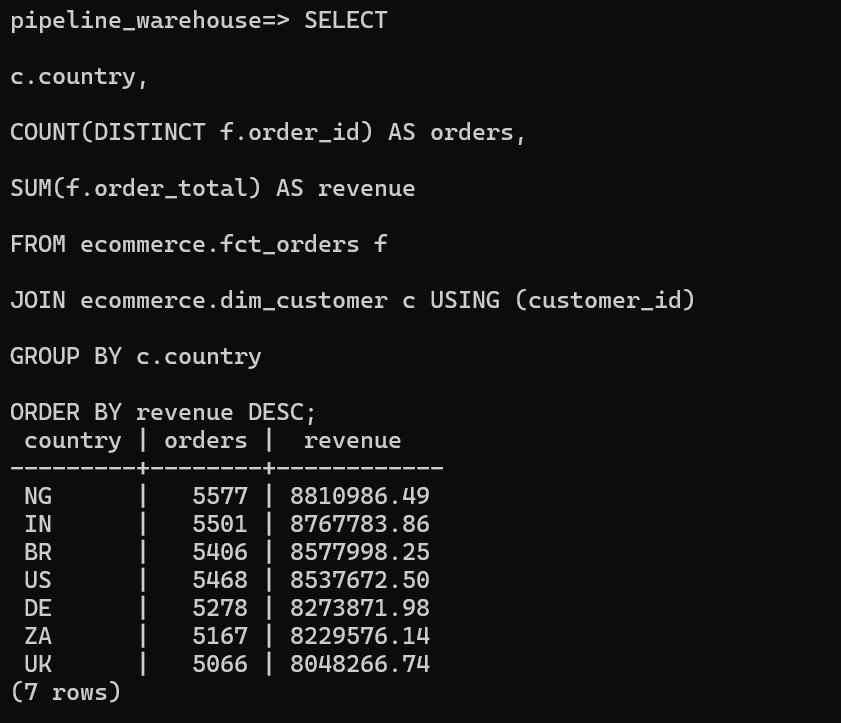
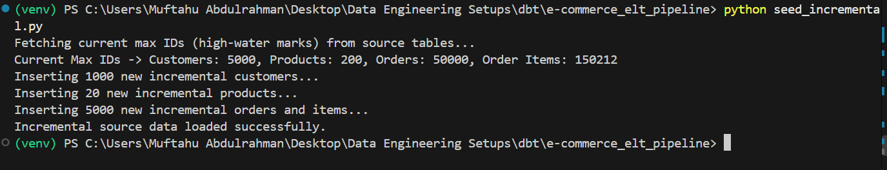

# VERIFIABLE RESULTS FROM ECOMMERCE DATA ANALYTICS PIPELINE ORCHESTRATION

### DOCKERIZED IMPLEMENTATION SETUP (AIRFLOW, AIRBYTE, POSTGRES)

### DB comformation of data on source DB `pipeline_source` after seeding

### Airbyte Connection from source `pipeline_source` to destination `pipeline_warehouse`.

### Orchestrated Airflow connection to Airbyte for incremental data sync (cursor)

### Successful Orchestration of data sync from `pipeline_source` to `pipeline_warehouse` and `dbt models run`

### Conformation of data on destination `pipeline_warehouse` via successful orchestration

 **Executing Analytic query on destination warehouse**
 

### Injecting new data (seed_incremental.py) to validate auto incremental fresh via airflow DAG workflow

